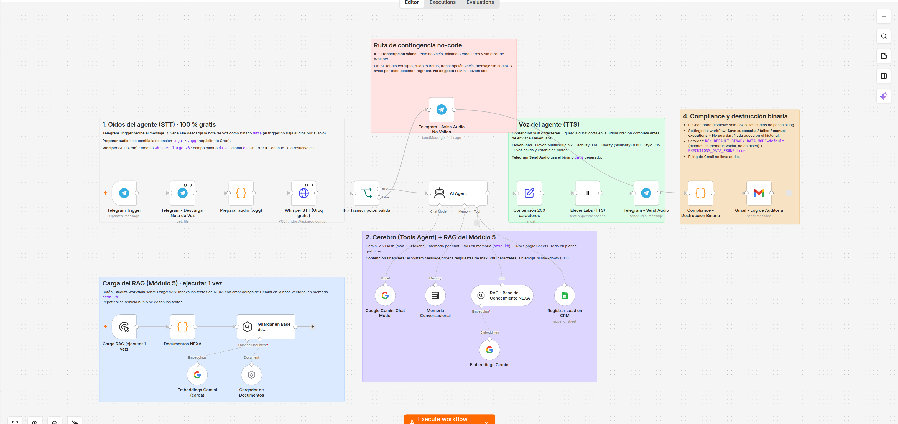

# Proyecto integrador NEXA DIGITAL · Agente de leads en n8n

| Hito | Archivo | Contenido |
|---|---|---|
| Checkpoint 1 | `checkpoint1_S_Maureira.json` | Agente base de calificación de leads (chat → AI Agent → Google Sheets → log Gmail) |
| Pre-entrega 6 · Voice AI | `checkpoint6_S_Maureira.json` | Circuito cerrado de voz 100 % gratis: Telegram → descarga de la nota de voz → Whisper vía Groq (STT) → IF de contingencia → AI Agent con Gemini (RAG + CRM) → límite de 200 caracteres → ElevenLabs (TTS) → Telegram Send Audio → destrucción binaria → log de auditoría |
| Entregable PDF | `PreEntrega6_VoiceAI_S_Maureira.pdf` | Captura del lienzo y de los paneles, diagnóstico de viabilidad (ROI / fatiga cognitiva), checklist de la consigna y configuración exportada en texto |

## Cómo importar el checkpoint 6 (todo gratis)
1. En n8n: **Workflows → Import from File** y elegí `checkpoint6_S_Maureira.json`.
2. Instalá el nodo verificado de ElevenLabs (`@elevenlabs/n8n-nodes-elevenlabs`).
3. Credenciales (todas gratuitas):
   - **Telegram**: token de @BotFather (Trigger, Descargar Nota de Voz, Send Audio y Aviso).
   - **Groq** (console.groq.com): credencial *Header Auth* con Name `Authorization` y Value `Bearer gsk_...` en el nodo *Whisper STT (Groq gratis)*.
   - **Google Gemini** (aistudio.google.com): chat model y los dos nodos de embeddings.
   - **ElevenLabs** (plan Free), **Google Sheets** y **Gmail**.
4. Ejecutá una vez el botón **Carga RAG (ejecutar 1 vez)** para indexar la base de conocimiento de NEXA. Repetilo si se reinicia n8n o se editan los textos.
5. Variables del servidor para compliance (si es self-hosted): `N8N_DEFAULT_BINARY_DATA_MODE=default` y `EXECUTIONS_DATA_PRUNE=true`.
